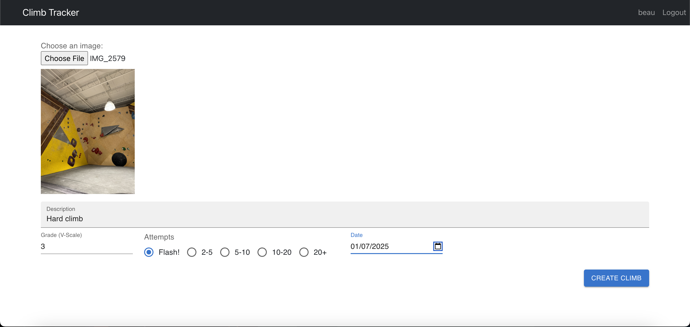
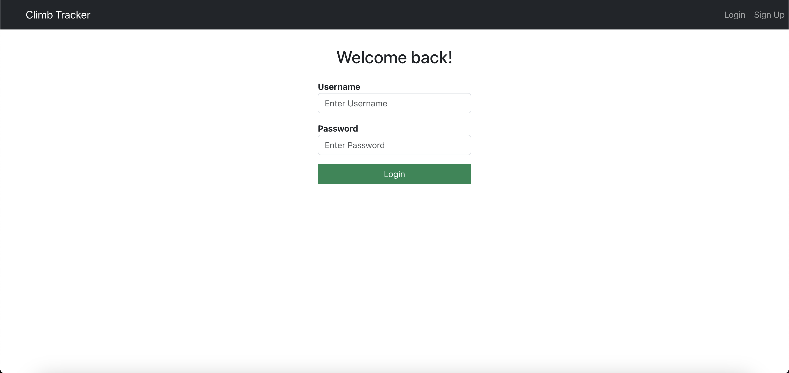

# climb_tracker_website
A website to keep track of each user's completed climbs. Currently wokring on also providing a visual overview of the data such as how many climbs of a certain grade you've done along with how many attempts it took you among other statistics. 

This is what greets you once you login to your account: 

 

Each climb shows its corresponding image along with the description, grade, attempts, and date along with buttons to edit or delete the climb

 

If you click on the floating plus button, you can add a new climbs you've done. 

and fill out all the info related to the climb. 

Clicking on the edit button will bring you to a very similar page except with all the info already filled out for you to change. 

When you first login to a new account, you won't have any climbs recorded yet. 

And when you logout, you'll be brought back to the login page. 

